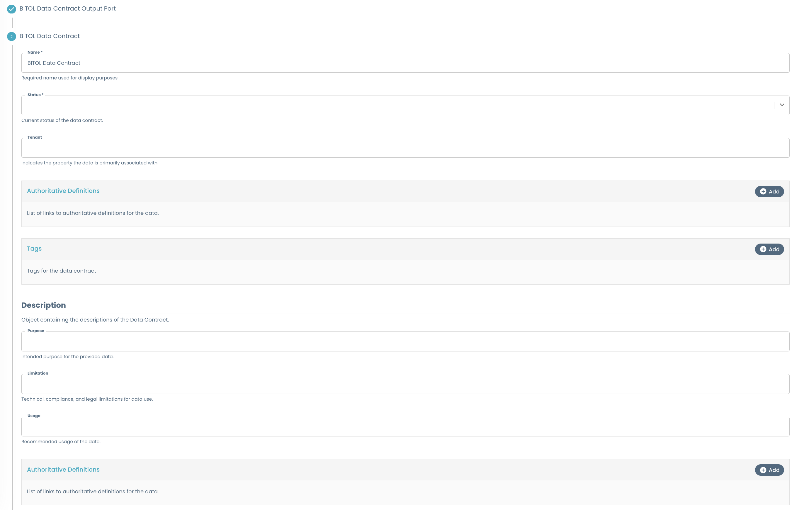
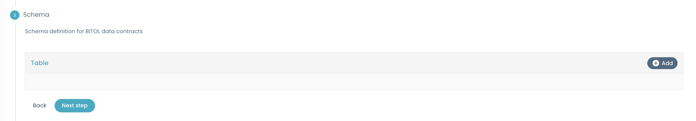
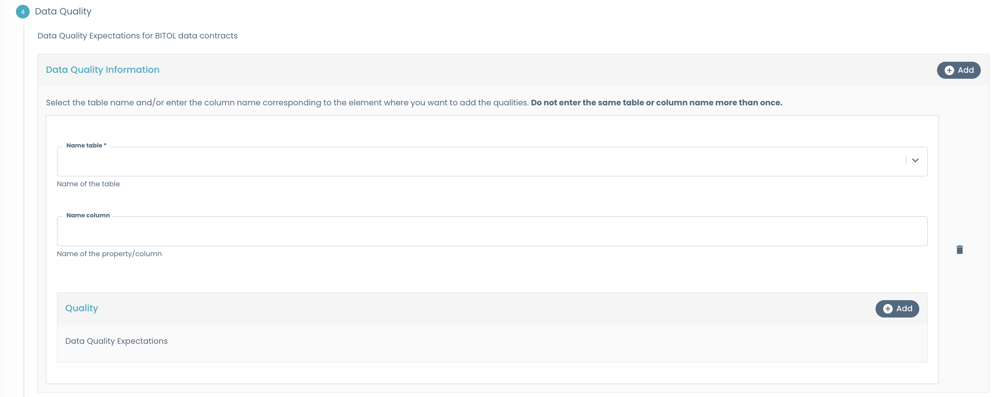
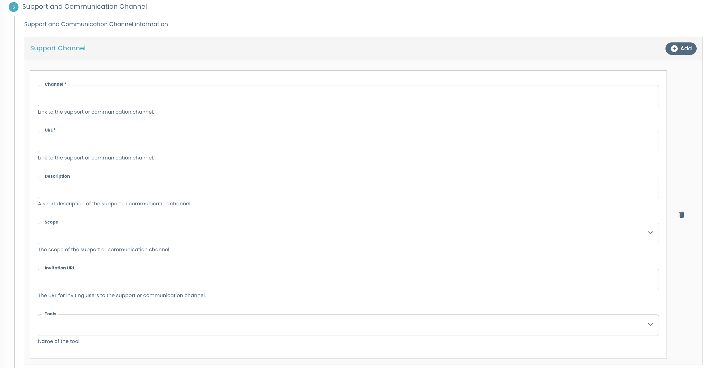
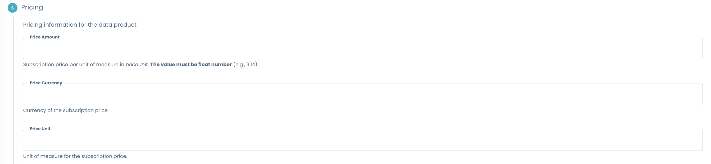
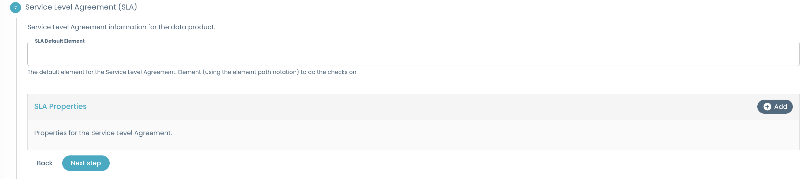
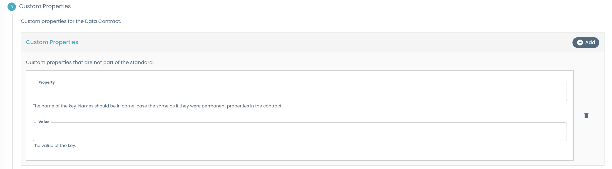

    

Designed by [Agile Lab](https://www.agilelab.it/), Witboost is a versatile platform that addresses a wide range of sophisticated data engineering challenges. It enables businesses to discover, enhance, and productize their data, fostering the creation of automated data platforms that adhere to the highest standards of data governance. Want to know more about Witboost? Check it out [here](https://www.witboost.com/) or [contact us!](https://witboost.com/contact-us).

#  BITOL Data Contract template

- [Overview](#overview)
- [Usage](#usage)

## Overview

Use this template to automatically create an output port governed by a BITOL Data Contract.

The BITOL Data Contract Template guides you through the configuration of a robust and well-structured Data Contract for exposing and governing data.

The main section are the following:

- **Output Port Metadata**: Collects essential information such as the name, description, domain, related the Output port, unique identifier, ownership, and dependencies.

- **Data Contract Details**: Allows you to define the core attributes of the data contract, including its name, status, authoritative definitions, and a structured description (purpose, limitations, usage, and references). This section captures the intent and governance of the contract.

- **Schema Definition**: Enables you to specify the schema for your data contract by defining one or more tables. For each table, you can add columns (properties) with their names and characteristics, supporting detailed data modeling.

 - **Data Quality**: Lets you set data quality expectations for tables and columns, including rules, dimensions, severity, and business impact, to ensure the reliability and trustworthiness of your data.

    > The ***table name*** on which to add a quality rule is selectable from existing tables, while the ***column name*** must be entered manually by the user.
    Make sure to use the exact name of an existing column. Also, **the combination of table and column name should not be repeated** to avoid duplicate quality rules.

- **Support and Communication Channels**: Provides a way to document available support channels (such as Slack, Teams, or email), including links, descriptions, and the scope of each channel, to facilitate communication and issue resolution.

- **Pricing**: Allows you to specify pricing information for the data contract, including amount, currency, and unit, supporting transparent data monetization.

- **Service Level Agreement (SLA)**: Lets you define SLA elements and properties, such as default elements, quality metrics, units, and drivers, to formalize service expectations.

- **Custom Properties**: Supports the addition of custom, user-defined properties to extend the data contract with organization-specific metadata.

- **Other Properties**: Includes additional fields such as the contract creation timestamp for audit and tracking purposes.

### What's a Template?

A Template is a tool that helps create components inside Witboost. Templates help establish a standard across the organization. This standard leads to easier understanding, management and maintenance of components. Templates provide a predefined structure so that developers don't have to start from scratch each time, which leads to faster development and allows them to focus on other aspects, such as testing and business logic.

For more information, please refer to the [official documentation](https://docs.witboost.com/docs/p1_user/p6_advanced/p6_1_templates/#getting-started).

#### Skeleton Entities

Introduced in **Witboost 2.3**, Skeleton Entities provide a more dynamic and user-friendly approach to define systems and components. They seamlessly integrate with tools like the Editor Wizard and the Reverse Provisioning Wizard, allowing for easier entity management.

For more information, please refer to the [official documentation](https://docs.witboost.com/docs/p3_tech/p12_catalog/p12_2_skeleton_entities).

### What's an Output Port?

An Output Port refers to the interface that a Data Product uses to provide data to other components or systems within the organization. The methods of data sharing can range from APIs to file exports and database links.

## Usage

To get information on how to use this template, refer to this [document](./docs/index.md).

### Component Testing

To verify the component before deploying it along with the Data Product, the component needs to be tested against a CUE Policy defined for [BITOL Data Contract](./policies/bitol_data_contract.cue). This policy needs to be defined inside the **Governance** section of the Witboost Platform.

For more information, please refer to the [official documentation](https://docs.witboost.com/docs/p1_user/p5_managing_policies/p5_1_overview).

## About Witboost

[Witboost](https://witboost.com/) is a cutting-edge Data Experience platform, that streamlines complex data projects across various platforms, enabling seamless data production and consumption. This unified approach empowers you to fully utilize your data without platform-specific hurdles, fostering smoother collaboration across teams.

It seamlessly blends business-relevant information, data governance processes, and IT delivery, ensuring technically sound data projects aligned with strategic objectives. Witboost facilitates data-driven decision-making while maintaining data security, ethics, and regulatory compliance.

Moreover, Witboost maximizes data potential through automation, freeing resources for strategic initiatives. Apply your data for growth, innovation and competitive advantage.

[Contact us](https://witboost.com/contact-us) or follow us on:

- [LinkedIn](https://www.linkedin.com/showcase/witboost/)
- [YouTube](https://www.youtube.com/@witboost-platform)
